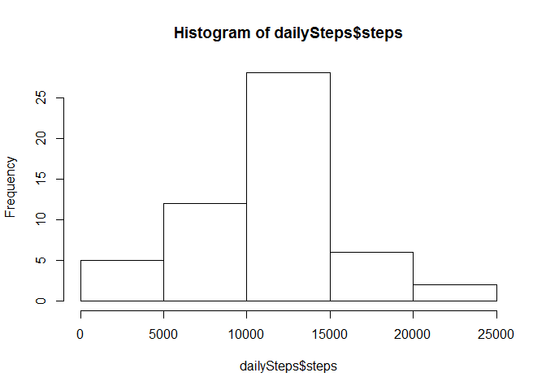
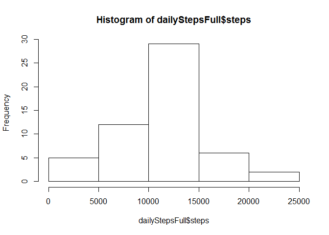
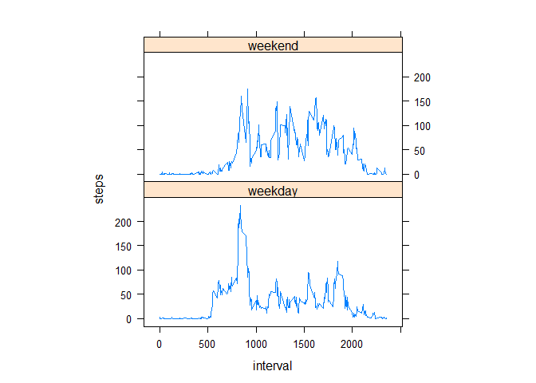

# Reproducible Research: Peer Assessment 1
In this assignment we will analyze data from a personal activity monitoring device. This device collects data at 5 minute intervals through out the day. The variables included in this dataset are:

 * steps: Number of steps taking in a 5-minute interval (missing values are coded as NA)

 * date: The date on which the measurement was taken in YYYY-MM-DD format

 * interval: Identifier for the 5-minute interval in which measurement was taken

## Loading and preprocessing the data

```r
library(lubridate)
activity <- read.csv(unz("activity.zip", "activity.csv"))
activity$date <- ymd(activity$date)
```


## What is mean total number of steps taken per day?
Calculate the total number of steps taken per day


```r
dailySteps <- aggregate(steps ~ date, data = activity, sum, na.rm = TRUE)
```

Below is a histogram of of the total number of steps taken each day


```r
hist(dailySteps$steps)
```

 

Calculate and report the mean and median

```r
stepsmean <- round(mean(dailySteps$steps), 2)
stepsmedian <- median(dailySteps$steps)
```

* The mean total number of steps taken per day is 10766.19.
* The median total number of steps taken per day is 10765.

## What is the average daily activity pattern?
The plot below shows the average number of steps taken (across all days) per the 5-minute intervals


```r
library(plyr)
byInterval <- ddply(activity, "interval", summarize, steps = mean(steps, na.rm = TRUE))
plot(steps ~ interval, byInterval, type="l")
```

 

Find the 5-minute interval that contains the maximum number of steps (on average across all days)

```r
maxInterval <- byInterval[which.max(byInterval$steps),"interval"]
maxInterval
```

```
## [1] 835
```

The interval that contains the maximum number of steps is interval 835.

## Imputing missing values
Calculate and report the total number of missing values in the dataset.

```r
missing <- sum(is.na(activity$steps))
missing
```

```
## [1] 2304
```

There are 2304 missing values.

The strategy that we will use for impting missing values is to take the rounded mean for the same 5-minute interval.

Create a new dataset that is equal to the original dataset but with the missing data filled in.

```r
activityFull <- activity
nas <- is.na(activity$steps)
activityFull[nas, "steps"] <- round(byInterval[byInterval$interval==activity[nas,"interval"], "steps"])
```

Make a histogram of the total number of steps taken each day


```r
dailyStepsFull <- aggregate(steps ~ date, data = activityFull, sum, na.rm = TRUE)
hist(dailyStepsFull$steps)
```

 

Calculate and report the mean and median

```r
stepsmeanFull <- round(mean(dailyStepsFull$steps), 2)
stepsmedianFull <- median(dailyStepsFull$steps)
```

* The mean total number of steps taken per day is now 10766.11.
* The median total number of steps taken per day is now 10763.5.

We can see that the impact of imputing the values is minimal, because we used the mean value across all days ti impute the missing values. The mean has changed by very little, just because we rounded the imputed numbers. The median has also just slightly changed.

## Are there differences in activity patterns between weekdays and weekends?

Create a new factor variable in the dataset with two levels -- "weekday" and "weekend" indicating whether a given date is a weekday or weekend day.


```r
activityFull$daytype <- as.factor(wday(activityFull$date) %in% c(1,7))
levels(activityFull$daytype) <- c("weekday", "weekend")
```

The plot below shows the average number of steps taken per the 5-minute intervals for weekends and weekdays


```r
library(lattice)
byInterval <- ddply(activityFull, c("interval", "daytype"), summarize, steps = mean(steps, na.rm = TRUE))
xyplot(steps ~ interval | daytype, byInterval, type="l", aspect = 1/2)
```

 

We can see that on weekends, the steps are spread accross a larger part of the day.
